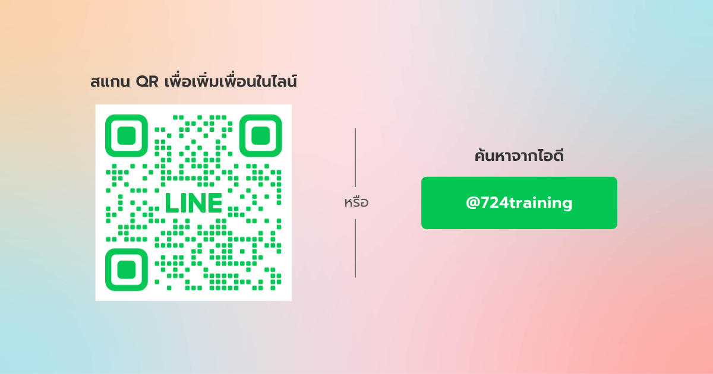

---
layout:
  title:
    visible: true
  description:
    visible: false
  tableOfContents:
    visible: true
  outline:
    visible: true
  pagination:
    visible: true
---

# ขั้นตอนการเชื่อมต่อกับ 724 Connext


**เพิ่มความสะดวกด้วย 724 Connext**

เพียงเชื่อมต่อกับ **724 Connext** เพื่อรับบริการที่ง่ายและสะดวกยิ่งขึ้น เช่น การตรวจสอบสถานะการสมัคร การติดตามข้อมูล หรือบริการอื่น ๆ ที่เกี่ยวข้อง ด้วยการเพิ่มเพื่อนใน LINE OA จาก QR ด้านล่าง หรือพิมพ์ค้นหาเพื่อน **"@724training"**


<figure>
  
  <figcaption>เพิ่มเพื่อน @724training</figcaption>
</figure>

**เพิ่มเพื่อนใน Line**
- เปิดแอปพลิเคชัน Line
- ค้นหา Line OA ของ 724 Market โดยใช้ฟีเจอร์ค้นหา
- เพิ่มบัญชี Line OA เป็นเพื่อน

---

# สำหรับสมาชิกระบบ 724 Agent Love

หลังจากลงชื่อเข้าสู่ระบบ 724 Agent เรียบร้อยแล้ว จะเจอหน้าหลักของระบบ ให้สมาชิกมองหากล่องข้อความ "**เชื่อมต่อ 724 Connext**"

<figure>
    
    <figcaption>
        
ขั้นตอนการเชื่อม Line Connext

    </figcaption>
</figure>

ทำตามขั้นตอน ดังนี้

**กดเพื่อเชื่อมต่อ**
   - เมื่อพบกล่อง "เชื่อมต่อ 724 Connext" ให้กดเลือก
   - ทำตามขั้นตอนที่ปรากฏบนหน้าจอเพื่อดำเนินการเชื่อมต่อบัญชี
     
**เข้าสู่ระบบ (ถ้ามี)**
   - หากระบบต้องการเข้าสู่ระบบ ให้กรอกข้อมูลบัญชีผู้ใช้ที่คุณลงทะเบียน
     
**ตรวจสอบสถานะ**
   - หลังจากเชื่อมต่อสำเร็จ คุณจะสามารถใช้งานฟีเจอร์ของ 724 Connext ผ่าน Line OA ได้ทันที

<figure>
    
    <figcaption>
        
เชื่อมต่อ 724 Line Connext สำเร็จ

    </figcaption>
</figure>

