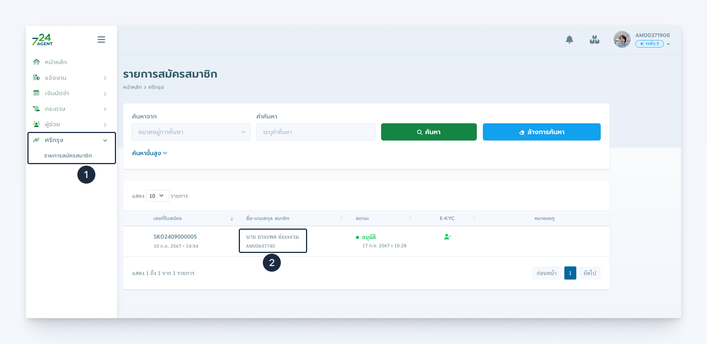

---
layout:
  title:
    visible: true
  description:
    visible: false
  tableOfContents:
    visible: true
  outline:
    visible: true
  pagination:
    visible: true
---

# คำถามที่พบบ่อย

<strong>สามารถทราบรหัสสมาชิกของผู้สมัครที่ได้รับการอนุมัติแล้วได้ที่ใด?</strong>

เข้าระบบ 724 Agent Love แล้วไปที่เมนู ศรีกรุง --> รายการสมัครสมาชิก ท่านจะเห็นตารางแสดงรายการผู้สมัครสมาชิกผ่านการแนะนำของท่าน

<figure>
  
  <figcaption>ตารางแสดงรายการผู้สมัครสมาชิก</figcaption>
</figure>


**เพิ่มความสะดวกด้วย 724 Connext**

เพียงเชื่อมต่อกับ **724 Connext** เพื่อรับบริการที่ง่ายและสะดวกยิ่งขึ้น เช่น การตรวจสอบสถานะการสมัคร การติดตามข้อมูล หรือบริการอื่น ๆ ที่เกี่ยวข้อง ด้วยการเพิ่มเพื่อนใน LINE OA จาก QR ด้านล่าง หรือพิมพ์ค้นหาเพื่อน **"@724training"**


<figure>
  
  <figcaption>เพิ่มเพื่อน @724training</figcaption>
</figure>
